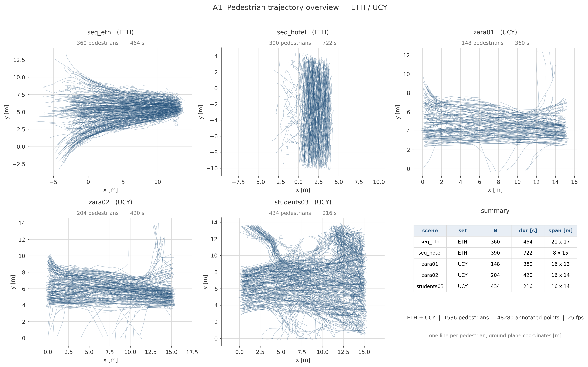

# week01 作业 — A1 画轨迹

每个个体一条线，绘制各场景的行人轨迹图。

## 轨迹图

## 分析结论

从轨迹图可以看出，五个场景的行人流在空间组织上分成两类。一类受建筑边界约束，人流被压缩在狭长通道内往复穿行，方向高度一致并自然形成双向对流；另一类较为开阔，行人自入口进入后在平面上扇形铺开，路径分散、朝向各异。这一差异会贯穿后续全部分析——通道型场景可以用截面法统计流率与密度，开阔型场景只能依靠区域平均，两者不能用同一套口径比较，否则基本图会失去可解释性。轨迹图还能直接读出入流口与流线汇聚的位置，这些位置正是行为分析阶段观察成行、避让与瓶颈现象的天然切入点。另需说明，其中一套数据的官方标注是带透视压缩的图像平面坐标，并非真实地面距离，若直接用于速度、间距与密度的计算，得到的数值不具备物理意义；本次已先折算为米制地面坐标再作图，原始标注另行保留以备溯源。两套数据的原点与朝向互不相同，因此各场景独立成图，不作跨场景叠加。

---

## 附：各场景单独成图

| 场景 | 图 |
|---|---|
| seq_eth | `figures/a1_traj_seq_eth.png` |
| seq_hotel | `figures/a1_traj_seq_hotel.png` |
| zara01 | `figures/a1_traj_zara01.png` |
| zara02 | `figures/a1_traj_zara02.png` |
| students03 | `figures/a1_traj_students03.png` |

代码：`a1_trajectories.py`　|　数据与规模说明：[`../datasets/README.md`](../datasets/README.md)
