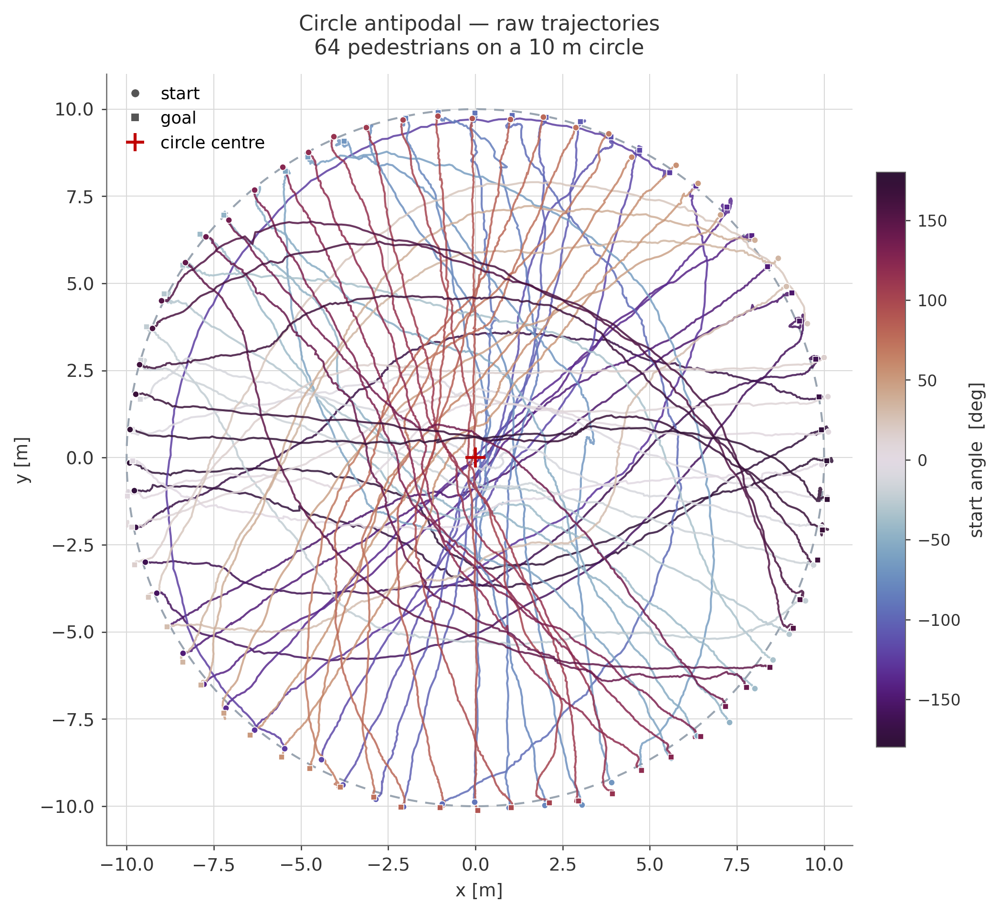
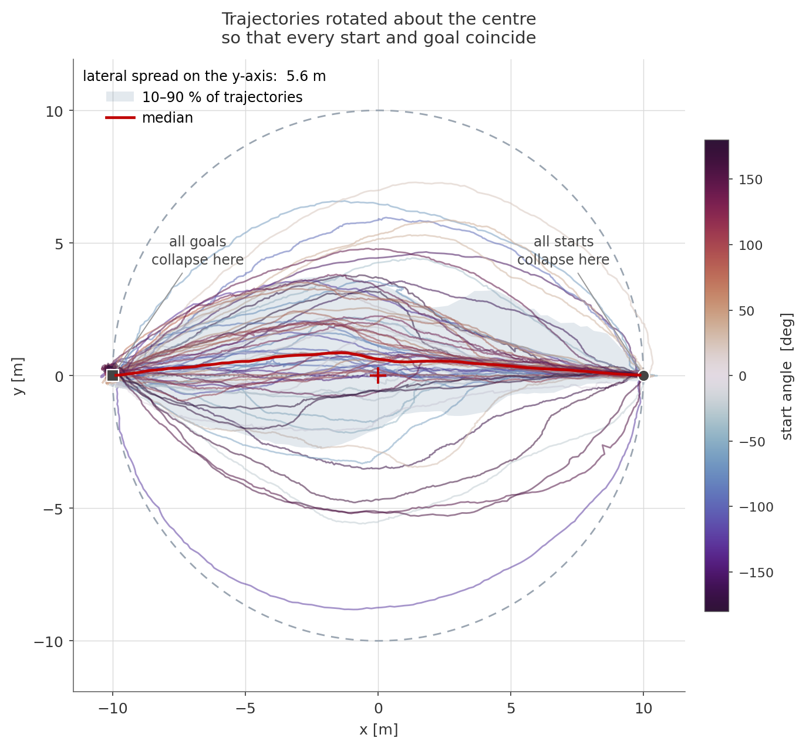
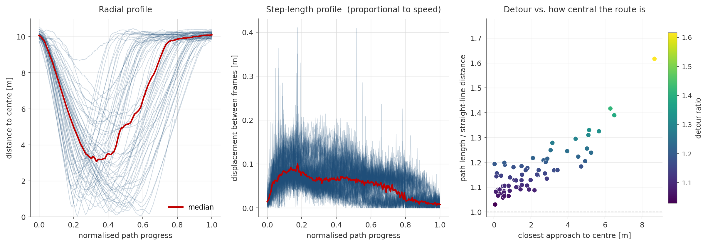
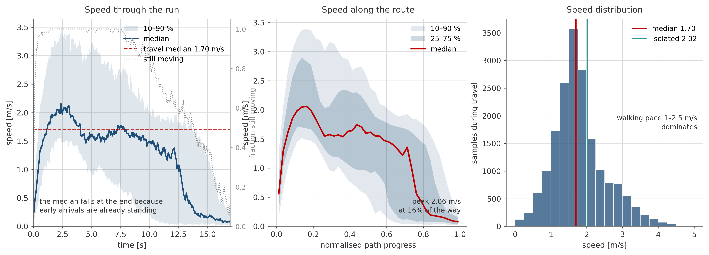
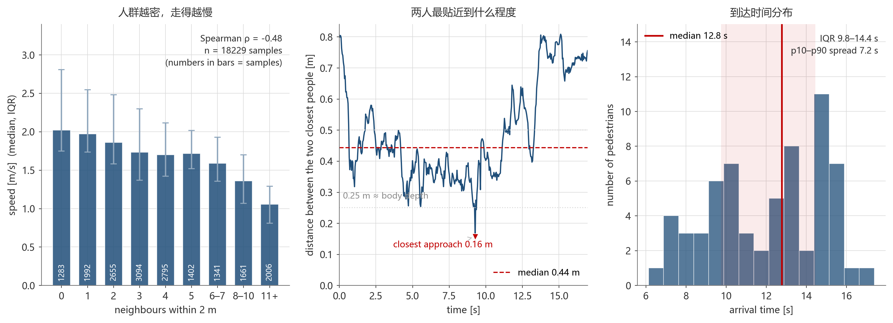
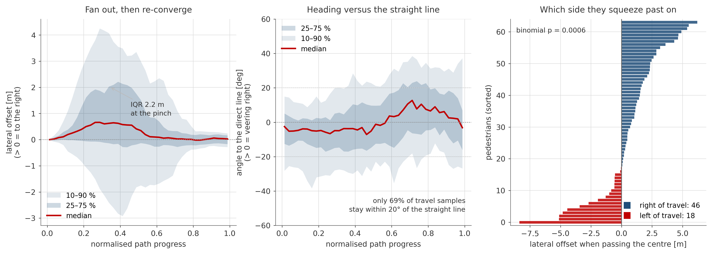
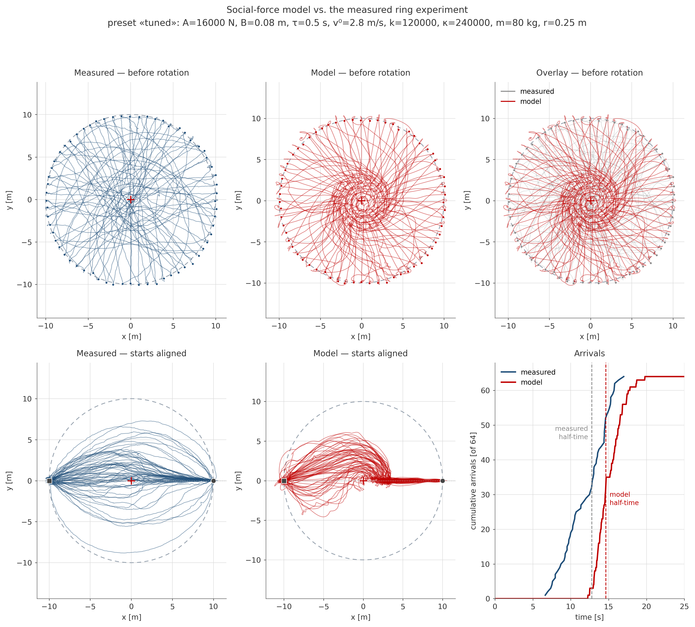
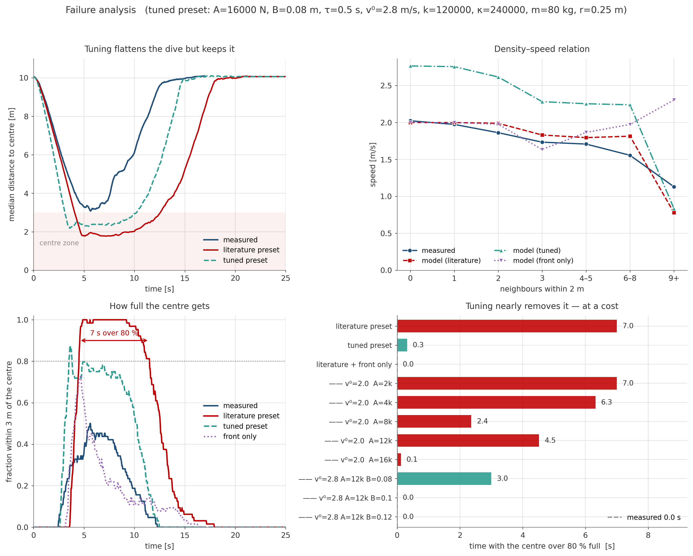
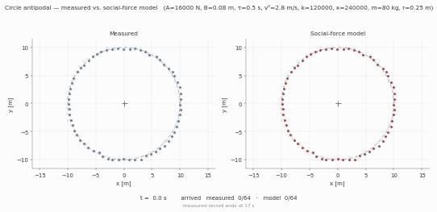

# week02 — 构建行人行为模型，复现圆环实验

> 目标：提出一个行人行为模型，复现实验中的关键运动现象。

## 进度

| 步骤 | 内容 | 状态 |
|---|---|---|
| ① | 形成行为判断 | ✅ 轨迹 + 速度 + 方向，见下文 |
| ② | 提出模型主张 | ✅ 社会力模型（三项力）+ 参数一览，见 `model/` |
| ③ | 实现与验证 | ✅ 已复现，含参数标定、失效分析与全程动图 |

## 提交结构

```
week02/
├── README.md             本文件：行为判断、模型主张、依据与失效条件
├── circle_data.py        数据读取与运动学量（共用模块）
├── analyze_circle.py     步骤① 轨迹可视化
├── analyze_dynamics.py   步骤① 速度与方向分析
├── data/
│   └── circle-10m-64-1.txt
├── model/
│   ├── social_force.py   社会力模型本体（三项力 + 参数预设）
│   ├── simulate.py       仿真、对比、失效分析、动图录制
│   ├── tune.py           参数筛选（单因子扫描 / 网格 / 区间细化）
│   └── README.md         模型主张、参数一览与标定结果
├── 作业.md              本页结论的连贯段落版（不列数字）
└── results/              图表（fig1–fig11 + 动图 GIF，全部高清 PNG）
```

## 数据

`data/circle-10m-64-1.txt`，5 列纯文本：

```
行人编号  帧号  x  y  未知
```

| 项目 | 内容 |
|---|---|
| 行人数 | 64 |
| 帧范围 | 37 – 461（每人 425 帧，**64 人共用同一套连续帧**） |
| 帧率 | **25 fps**，帧间隔 0.04 s，全程 17.0 s |
| 坐标单位 | cm（圆周半径约 1000 cm = 10 m） |
| 起点半径 | 9.72 – 10.52 m |
| 第 5 列 | 每人定值（160 / 170 / 180），与行走方向不对应，不使用 |

> ⚠️ 第 2 列是**帧号**而不是行人编号，容易读反。只有固定第 1 列、让第 2 列递增，轨迹才会从圆周一端平滑穿过圆心走到对侧。
>
> ⚠️ 目标点由数据给出：每个人的首末位置之差为 19.7–20.6 m，而"起点的对趾点"与真实终点的距离中位仅 0.25 m。**目标就是起点的对趾点**，这一点在建模时不需再标定。

### 速度估计的注意事项

位置由质心轨迹给出，相邻帧位移中位仅约 5 cm，差分噪声不可忽略。若直接用相邻帧差分，最大速率会到 10 m/s 以上，明显是跟踪噪声而非真实运动。

本目录统一做法：位置先做 5 帧（0.2 s）滑动平均，再用中心差分。这样得到的两端静止段是真实的（末 30 帧中位速率 0.15 m/s），而速率尾部收敛到 4.5 m/s。`analyze_circle.py` 报告中另给出未平滑的原始数值，供对照。

另外，64 人的记录长度完全相同、且共用同一帧号网格，因此不存在"从到达时刻反推数据被裁剪过"的问题——每个人都是被完整记录了 17 s，早到的人后半程确实站在原地。

## 步骤 ① 形成行为判断

### 轨迹图

**原始轨迹** —— 各行人在自己的起始方位上：



**绕圆心旋转对齐后** —— 把每条轨迹旋转 −θ₀，使所有起点方位角归零，于是全部起点重合于圆周右侧、全部终点重合于左侧：



**几何统计** —— 半径剖面、路线选择、迂回程度：



### 速度分析（帧率 25 fps）





### 方向分析



复现：

```bash
python week02/analyze_circle.py
python week02/analyze_dynamics.py
```

### 观察到什么

这是一次标准的圆环对趾实验：行人均匀分布在圆周上，各自要走到正对自己的另一侧，因此所有人的目标线都穿过圆心，冲突不可避免。

轨迹图显示，人流的整体形状是一条从圆周一侧收缩、在圆心附近最窄、再向对侧张开的束。旋转对齐之后这一点看得最清楚——所有轨迹被压进同一条横向通道里，中位路径几乎贴着两点之间的直线，但个体之间的横向散布相当可观：把横向偏移按路径进度摊开，中位人的偏移量始终只有半米上下，而 10–90% 区间在行进中段宽达七八米。换句话说，这条"束"看起来是收拢的，是因为左右两侧的人互相抵消，不是因为每个人都在走直线。真正贴着中心线走完的只是一部分人。

路线选择上呈现出明显的两极：一部分人从圆心两米以内穿过，另一部分人则远远地贴着外圈绕过去，避让的代价几乎全落在后者身上——绕行者走的距离明显更长，最近圆心距离与迂回系数之间是单调的正相关关系。这正是对趾场景的核心矛盾：走中心最短，但中心最挤。

速度方面，行人的期望速度在 2 m/s 上下，全程速率分布的主体落在 1–2.5 m/s 区间，是一个相当集中的"步行速度核心"。但速率不是恒定的：起步后逐步加速，行进中段达到峰值，临近目标时持续减速到静止，中位人的速率曲线是清晰的三段式。与此同时，速率随周围人数的增加而系统性下降，两者呈中等强度的负相关；完全孤立时的速率明显高于被人群包围时的速率。这说明行人确实会因为别人的存在而放慢，而不是各走各的。

方向方面，与"起点—目标直线"相比，行人在行进段的中位偏航角在十几度，但有相当比例的时间偏航超过二十度，最拥挤的阶段远不止于此。更值得注意的是**过中心时的侧别分布并不是对半开的**：以行进方向为参照，从右侧挤过去的人数接近左侧的两倍半，这个偏斜在统计上极其显著（二项检验 p ≈ 0.0006），而且与每个人的起始方位角几乎无关。这种"约定俗成"的侧向偏好，是从个体层面的排斥力里长不出来的——它需要一个超越两两对称性的机制。

关于安全性：全场最近两人间距的中位值约 0.4 m，已经小于两人身体半径之和；最小间距只有 0.16 m，也就是说真实数据里存在身体挤压。同时接触的人最多达到十一对。**接触力不是可选项**，它在这次实验里实实在在地被用到了。

### 可以检验的行为判断

据此提出三条可以量化检验的判断，作为步骤 ② 建模的依据：

1. **两侧都走，人数不对称**：过中心时右侧人数显著多于左侧，说明行人带有一种共享的侧向偏好，而两两对称的排斥力本身不含这种偏好。
2. **避让的代价集中**：避让主要发生在接近中心之前，横向散布在中段达到最大、两端收敛；绕行者的迂回程度与最近圆心距离单调正相关。
3. **速率受密度压制**：速率与周围人数负相关，孤立行人更快；行人不是匀速走完这段路，而是"加速—巡航—减速"。

三条都将在步骤 ③ 中用仿真结果与真实轨迹的对比来检验。

## 步骤 ② 提出模型主张

模型主张：**只用终点吸引力、行人间的排斥力和接触力，就能让 64 个行人从这个圆环的对趾点走到对侧，且能重现"中心最窄、两侧散开"的束状人流。** 但侧别偏好与拥堵的疏散方式，需要额外的机制。

采用 Helbing 的社会力模型（1995 排斥力 + 2000 接触力），控制方程：

```
m_i dv_i/dt = m_i (v⁰ e_i − v_i) / τ                                    ← 终点吸引力
              + Σ_j [ A exp((r_ij − d_ij)/B) + k·g(r_ij − d_ij) ] n_ij  ← 排斥力 + 法向接触力
              + Σ_j  κ·g(r_ij − d_ij) (Δv_ji · t_ij) t_ij                ← 切向摩擦
```

其中 `g(x) = max(0, x)`，`e_i` 指向对趾点，`r_ij = 2r`。

参数取 Helbing 的原始值，只把期望速度按实测的自由流速标定。**共 11 个可调量**，分三类：

| 类别 | 参数 | 文献值 | 是否调过 |
|---|---|---|---|
| 行为 | 松弛时间 τ、期望速度 v⁰、排斥力强度 A、排斥力尺度 B | 0.5 s / 2.0 m/s / 2000 N / 0.08 m | v⁰ 与 A 标定过（→ 2.8 m/s、16000 N） |
| 身体 | 法向弹性 k、切向摩擦 κ、体重 m、身体半径 r | 1.2e5 / 2.4e5 / 80 kg / 0.25 m | 未调，但 r 被证明可疑 |
| 数值 | 内部步长 dt、排斥力截断 rep_cutoff、仅前方开关 front_only | 2 ms / 3.0 m / False | 均不影响行为 |

每个参数各自控制什么、调大调小的后果，见 [`model/README.md`](model/README.md#参数一览) 的完整表格；标定过程由 [`model/tune.py`](model/tune.py) 完成，结果见 `results/fig9`–`fig11`。

积分用显式欧拉，内部步长 2 ms（身体挤压的固有周期约 0.16 s，2 ms 足够稳），再按 25 fps 重采样，与实测对齐。

这一步**刻意只加这三项力**：不加墙壁力（场景里没有墙）、不加成组力、不加视野各向异性、不加随机扰动。目的是先看清这三项力能把实验复现到什么程度、在哪里失效。

各力的作用与标定依据见 `model/README.md`。

## 步骤 ③ 实现与验证



上排是**旋转之前**的世界系轨迹，下排是对齐后的形态。世界系这一排最能看清
模型的毛病：实测的轨迹是一条条近乎笔直的弦，直接从圆周一端切到对侧；模型
的轨迹却先绕着小圈打转、再卷向圆心，起手就在原地纠缠。



**全程动图**（左＝实测，右＝模型，同一个坐标系与时间轴；压缩过的 GIF）：



复现：

```bash
python week02/model/simulate.py          # 对比 + 失效分析
python week02/model/tune.py              # 参数筛选（约 5 分钟）
python week02/model/simulate.py --sweep --gif   # 附加扫描并录动图
```

仿真从**实测的初始位置**出发，目标取实测起点的对趾点，因此比较的是"同样初始条件、同样目标下模型与真人的差别"，而不是两次不同实验之间的统计量比较。参数有两组预设：`literature`（Helbing 原始值）与 `tuned`（本次标定，默认）。所有参数都可以用 `--set key=value` 单独覆盖，详见 [`model/README.md`](model/README.md#参数一览)。

### 哪些证据支持

**1. 三项力足以把人送到对侧。** 两组预设下 64 人都全部到达目标，没有死锁或原地振荡。终点吸引力 + 排斥力足以产生单向的对趾流动。

**2. 束状人流的形状被复现了。** 对齐后的轨迹形态与实测同类：起点收敛、中段散开、终点收拢。标定后横向散布的 IQR 为 2.16 m，文献值预设为 1.61 m，实测为 3.25 m——方向和量级都对，但模型偏窄。

**3. 密度—速度的负相关方向正确。** 模型里速率同样随邻居数增加而下降，与实测的趋势一致。

**4. 侧别偏好不需要显式规定就能被复制。** 模型得到的过中心右/左人数为 47/17，实测为 46/18。实测里那个显著不对称的侧别分布，在模型里由相互作用自然产生了。

### 哪些证据不支持 / 何时失效

**失效一（文献值预设）：三项力在圆心制造了一场 7 秒的全员拥堵。**

模型的行为序列是"先冲进中心、再在中心堆住、然后才挤出去"：开始后 5 s 左右 64 人全部进入离圆心 3 m 以内并几乎完全停滞；实测则从头到尾没有出现"大部分人挤在中心"的时刻，中心区人数占比峰值只有 0.50。

**失效二：这套行为不是参数的错，但也没法靠参数真正修好。**

调参可以把拥堵从 7.0 s 压到 0.3 s，把中位到达时间从 17.8 s 拉近到 14.6 s，侧别分布还几乎完全对上。但代价很具体：

- 排斥力要放大到文献值的 **8 倍**（A = 2000 → 16000 N）。这个量级已经不能算"心理排斥"，实际上把软排斥改造成了近似硬球的约束——**表面在调参数，实质在换机制**。
- **接触力被"调没"了**：标定后最小两人间距反而是 0.516 m，模型里从头到尾几乎没有身体接触（0.0% 的时刻），而实测有 62.6% 的时刻存在接触、最小间距只有 0.156 m。用户点名要的"接触力"这一项，在标定后的配置里其实一次都没真正起作用。
- **横向散布反而更远离实测**：要让人群散得更开只能加大 B，而 B 一大就有人到不了目标（B = 0.20 m 时只有 47/64 人到达）。
- 打分最优其实落在 v⁰ = 4 m/s、A = 16000 N 上，但那是靠"所有人以超出实测上限的速度冲刺"换来的，不能采用。

**失效三：方向上的一个反例。**

"仅前方排斥"这个探针（只保留来自前半平面的排斥力，模拟"人看不到身后"）把中心拥堵直接降到 **0.0 s**，中位到达时间降到 14.1 s，横向散布 3.47 m（最接近实测的 3.25 m），接触率 35.0%——**在中位到达时间、横向散布、接触率三项上都优于调参结果**。但它把过中心的侧别分布反转成 17 右 / 47 左，与实测的 46 右 / 18 左完全相反。

**失效四：身体不是半径 0.25 m 的硬圆盘。**

共用同一个不变半径的圆盘会把真实行的"贴身擦过"挡在外面。实测最小间距 0.156 m 远小于 2r = 0.5 m，接触力的活跃程度（62.6%）远超任何一组参数下的模型（0.0%–35%）。这说明身体几何本身也是模型需要改的地方。

### 失效说明了什么

把上面几条放在一起，结论比"差一点没调好"要具体得多：**拥堵、横向散布、侧别这三件事被同一个自由度牵着走，而这个自由度是参数调不出来的。**

调大排斥力能把拥堵压下去，却让接触失效、人群变窄；加大作用尺度能把人群铺开，却会有人到不了目标；而"仅前方排斥"这一项机制改动同时改善了拥堵、横向散布和接触率，唯独把侧别翻了过来。这说明三力模型缺的不是某个参数，而是一个**方向性的机制**——行人不是各向同性地互相推开，而是沿着一个共享的侧向约定分流。实测里"右侧通行者占绝对多数"这一点，正是那个缺失机制的痕迹：它把对撞的人流劈成两股，从而既避免了中心拥堵，又固定了侧别。

下一步的方向因此不在调参，而在补机制：

1. **视野各向异性**：排斥力按 `(λ + (1−λ)(1+cos φ)/2)` 加权，φ 为邻居相对自身朝向的夹角。这是 Helbing 原文里就有、本次刻意省略的一项，"仅前方排斥"的探针已显示它对拥堵极其敏感。
2. **侧向偏好**：给每人的期望方向加一个固定角度的右侧偏置，检验能否同时修好侧别与拥堵，而不再像"仅前方"那样以牺牲侧别为代价。
3. **可挤压的身体**：把固定半径的硬圆盘换成按方向伸缩的身体，让"贴身擦过"成为可能。
4. **期望速度的个体差异**：目前全体共用一个 v⁰；接口已支持逐人指定，可以从实测里逐人取各自的自由流速。

## 使用的资料与工具

| 类别 | 内容 |
|---|---|
| 数据 | 课程提供的圆环对趾实验数据 `circle-10m-64-1.txt` |
| 参考模型 | Helbing & Molnár, Phys. Rev. E 51(5):4282, 1995（排斥力 + 终点吸引）；Helbing, Farkas & Vicsek, Nature 407:487, 2000（接触力与摩擦） |
| 开源代码 | 未使用第三方仿真库或代码，模型、积分、参数筛选均自行实现；共用模块 `circle_data.py` |
| 图表 | matplotlib（全部 `dpi=300` 高清 PNG），动图由 Pillow 合成 GIF |
| 大模型辅助 | 本报告的结构与文字由大模型协助整理；模型参数取自上述文献原始值，期望速度与排斥力强度由本数据标定，标定过程与代价见 `model/README.md` |
